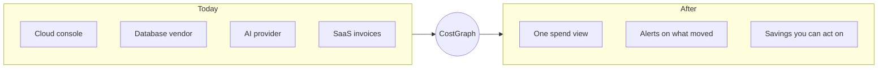
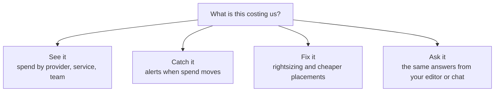

Your bill is spread across a dozen vendors, each with its own console, its own export,
and its own idea of what a "resource" is. CostGraph connects to all of them and gives
you one view of what you spend, what it is spent on, and what to do about it.

<CardGroup cols={3}>
  <Card title="22 providers" icon="plug">
    Clouds, databases, AI, and developer tools, side by side.
  </Card>
  <Card title="Connect in minutes" icon="bolt">
    A read-only credential per provider. Nothing to deploy, nothing to schedule.
  </Card>
  <Card title="Same answers everywhere" icon="layer-group">
    Every view, alert, and tool covers every connected provider.
  </Card>
</CardGroup>

## What connecting changes

Before, answering "what did we spend last month, and why is it up?" means four consoles
and a spreadsheet. After, it is one question in one place, and the answer covers every
provider you connected.

## Two ways to connect

<CardGroup cols={2}>
  <Card title="CostGraph pulls it" icon="cloud-arrow-down">
    Give us a read-only credential and your spend keeps itself current. This is how most
    providers work, and it is the fastest way to start.
  </Card>
  <Card title="You push it" icon="cloud-arrow-up" href="/costgraph/integrations/focus-push">
    Send your billing data to us instead. Your credentials stay in your infrastructure,
    and it covers anything we cannot reach: an internal chargeback system, a warehouse
    job, a private cloud.
  </Card>
</CardGroup>

<Note>
Not sure which you want? Start with a pull connection. You can add a pushed source later
without changing anything that already works.
</Note>

## Providers

### Hyperscalers

<CardGroup cols={2}>
  <Card title="Amazon Web Services" icon="aws" href="/costgraph/integrations/aws">
    Your AWS bill, down to the resource.
  </Card>
  <Card title="Google Cloud" icon="google" href="/costgraph/integrations/gcp">
    Your Google Cloud bill, down to the resource.
  </Card>
</CardGroup>

### Cloud and edge

<CardGroup cols={3}>
  <Card title="DigitalOcean" icon="digital-ocean" href="/costgraph/integrations/digitalocean">
    Droplets, volumes, load balancers, databases, spaces.
  </Card>
  <Card title="OVHcloud" icon="cloud" href="/costgraph/integrations/ovhcloud">
    Every product on the bill, with Public Cloud usage per project.
  </Card>
  <Card title="STACKIT" icon="cloud" href="/costgraph/integrations/stackit">
    Managed services, attributed per project.
  </Card>
  <Card title="Scaleway" icon="cloud" href="/costgraph/integrations/scaleway">
    Per project and per resource.
  </Card>
  <Card title="Cloudflare" icon="cloudflare" href="/costgraph/integrations/cloudflare">
    Usage across every Cloudflare product.
  </Card>
  <Card title="Vercel" icon="vercel" href="/costgraph/integrations/vercel">
    Team spend, split by project.
  </Card>
</CardGroup>

### Data and streaming

<CardGroup cols={3}>
  <Card title="PlanetScale" icon="database" href="/costgraph/integrations/planetscale">
    Database spend, plus rightsizing for the databases behind it.
  </Card>
  <Card title="Redis Cloud" icon="database" href="/costgraph/integrations/rediscloud">
    Per subscription and per database.
  </Card>
  <Card title="Confluent Cloud" icon="wind" href="/costgraph/integrations/confluent">
    Kafka spend per cluster and environment.
  </Card>
</CardGroup>

### AI and LLM

Model spend sits next to infrastructure spend, so the AI line stops being a separate
argument at the end of the month.

<CardGroup cols={3}>
  <Card title="Anthropic" icon="robot" href="/costgraph/integrations/anthropic">
    Spend per model.
  </Card>
  <Card title="OpenAI" icon="robot" href="/costgraph/integrations/openai">
    Spend per model.
  </Card>
  <Card title="OpenRouter" icon="shuffle" href="/costgraph/integrations/openrouter">
    One connection covers every model you route through it.
  </Card>
  <Card title="Helicone" icon="shuffle" href="/costgraph/integrations/helicone">
    Gateway spend across every upstream provider.
  </Card>
  <Card title="RespanAI" icon="shuffle" href="/costgraph/integrations/respanai">
    Request spend across every routed model.
  </Card>
  <Card title="Cursor" icon="code" href="/costgraph/integrations/cursor">
    Team usage, per model and per member.
  </Card>
</CardGroup>

### Developer platforms and compute

<CardGroup cols={2}>
  <Card title="GitHub" icon="github" href="/costgraph/integrations/github">
    Actions minutes, Packages storage, Copilot seats.
  </Card>
  <Card title="Modal" icon="microchip" href="/costgraph/integrations/modal">
    Serverless GPU and compute, per function.
  </Card>
</CardGroup>

### Observability and FinOps

<CardGroup cols={3}>
  <Card title="Datadog" icon="dog" href="/costgraph/integrations/datadog">
    What Datadog itself costs you, by product.
  </Card>
  <Card title="Grafana Cloud" icon="chart-line" href="/costgraph/integrations/grafanacloud">
    Metrics, logs, traces, and profiles per stack.
  </Card>
  <Card title="CostGraph" icon="dollar-sign" href="/costgraph/integrations/costgraph">
    Your CostGraph invoice, in the same view as everything else.
  </Card>
</CardGroup>

### Anything else

<Card title="Send your own data" icon="cloud-arrow-up" href="/costgraph/integrations/focus-push">
  A provider we do not list, an internal chargeback system, a private cloud. Send it
  yourself and it behaves like any other connected source.
</Card>

## Connecting one

<Frame caption="Settings -> Integrations. Every provider, with a setup guide next to it.">
  
</Frame>

<Steps>
  <Step title="Pick the provider">
    Open **Settings -> Integrations** and choose it from the catalogue.
  </Step>
  <Step title="Name the connection and pick the tenant">
    The tenant decides which team or environment the charges belong to.
  </Step>
  <Step title="Enter the credential and connect">
    The form asks for exactly what that provider needs and explains the permission each
    value requires. We check the credential before saving, so a wrong value fails while
    you are still on the form rather than silently at 3am.
  </Step>
</Steps>

<Note>
Credentials are encrypted at rest and used only to read billing data. Revoke the key at
the provider and that connection stops. Nothing else is affected.
</Note>

## What you get back

<Frame caption="One total, one trend, every connected provider.">
  
</Frame>

A connection is not a dashboard tile. Once a provider is connected it is part of every
answer CostGraph gives:

<CardGroup cols={2}>
  <Card title="Cost Overview" icon="chart-pie">
    Month-to-date and historical spend, sliced by provider, service, and team.
  </Card>
  <Card title="Anomaly detection" icon="triangle-exclamation">
    Spikes, waste, and drift, caught inside a provider and across providers.
  </Card>
  <Card title="Recommendations" icon="wand-magic-sparkles" href="/costgraph/agent/recommendations">
    Rightsizing and cheaper placements, priced before you commit to them.
  </Card>
  <Card title="MCP and the agent" icon="plug" href="/costgraph/mcp/install">
    Ask about any connected provider from your editor or from chat.
  </Card>
</CardGroup>
