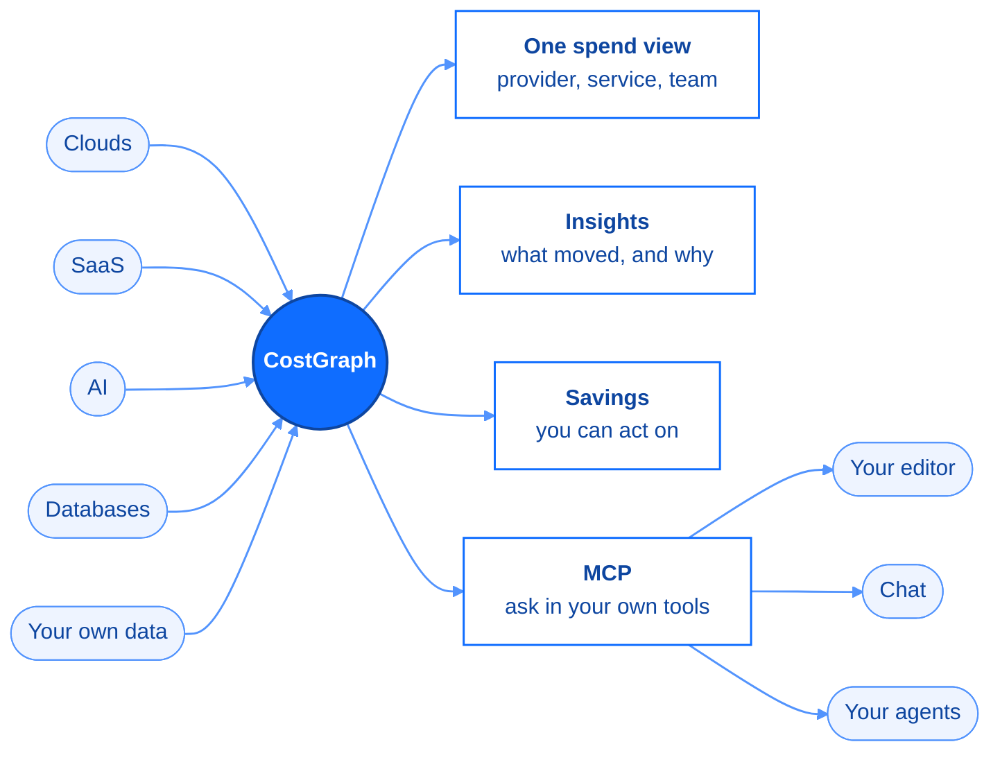

Your bill is spread across vendors, each with its own console, its own export, and its
own idea of what a "resource" is. CostGraph connects to the ones below, takes
your own data for anything else, and gives you one view of what you spend, what it is
spent on, and what to do about it.

<CardGroup cols={3}>
  <Card title="Numerous providers" icon="plug">
    Clouds, databases, AI, and developer tools, side by side.
  </Card>
  <Card title="Connect in minutes" icon="bolt">
    A read-only credential per provider. Nothing to deploy, nothing to schedule.
  </Card>
  <Card title="Same answers everywhere" icon="layer-group">
    Every view, insight, and tool covers every connected provider.
  </Card>
</CardGroup>

## What connecting changes

Every provider you connect feeds the same place, so "what did we spend last month, and
why is it up?" stops being four consoles and a spreadsheet. It is one question, and the
answer covers everything you connected.

## Four ways to connect

<CardGroup cols={2}>
  <Card title="CostGraph pulls it" icon="cloud-arrow-down">
    Give us a read-only credential and your spend keeps itself current. This is how most
    providers work, and it is the fastest way to start.
  </Card>
  <Card title="You push it" icon="cloud-arrow-up" href="/costgraph/integrations/push/focus-push">
    Send your billing data to us instead. Your credentials stay in your infrastructure,
    and it covers anything we cannot reach: an internal chargeback system, a warehouse
    job, a private cloud.
  </Card>
  <Card title="We read your telemetry" icon="chart-line" href="/costgraph/integrations/telemetry/ai-gateways">
    An AI gateway in your cluster has no bill to read. CostGraph reads its token
    metrics through the operator and prices them against the model catalog.
  </Card>
  <Card title="CostGraph exports it" icon="file-invoice-dollar" href="/costgraph/integrations/exports/autumn">
    The other direction: report each customer's attributed spend to your billing
    platform, so you can bill them for it.
  </Card>
</CardGroup>

<Note>
Not sure which you want? Start with a pull connection. You can add the others later
without changing anything that already works.
</Note>

## Providers

### Compute

<CardGroup cols={3}>
  <Card title="Amazon Web Services" icon="/images/logos/aws.svg" href="/costgraph/integrations/pull/cloud/aws">
    Your AWS bill, down to the resource.
  </Card>
  <Card title="Google Cloud" icon="/images/logos/gcp.svg" href="/costgraph/integrations/pull/cloud/gcp">
    Your Google Cloud bill, down to the resource.
  </Card>
  <Card title="DigitalOcean" icon="/images/logos/digitalocean.svg" href="/costgraph/integrations/pull/cloud/digitalocean">
    Droplets, volumes, load balancers, databases, spaces.
  </Card>
  <Card title="OVHcloud" icon="/images/logos/ovhcloud.svg" href="/costgraph/integrations/pull/cloud/ovhcloud">
    Every product on the bill, with Public Cloud usage per project.
  </Card>
  <Card title="STACKIT" icon="/images/logos/stackit.svg" href="/costgraph/integrations/pull/cloud/stackit">
    Managed services, attributed per project.
  </Card>
  <Card title="Scaleway" icon="/images/logos/scaleway.svg" href="/costgraph/integrations/pull/cloud/scaleway">
    Per project and per resource.
  </Card>
  <Card title="Akamai Cloud (Linode)" icon="/images/logos/linode.svg" href="/costgraph/integrations/pull/cloud/linode">
    Every line item on the invoice.
  </Card>
  <Card title="Cherry Servers" icon="/images/logos/cherryservers.svg" href="/costgraph/integrations/pull/cloud/cherryservers">
    Bare metal, priced per server.
  </Card>
  <Card title="Vercel" icon="/images/logos/vercel.svg" href="/costgraph/integrations/pull/cloud/vercel">
    Team spend, split by project.
  </Card>
  <Card title="Modal" icon="/images/logos/modal.svg" href="/costgraph/integrations/pull/cloud/modal">
    Serverless GPU and compute, per function.
  </Card>
  <Card title="RunPod" icon="/images/logos/runpod.svg" href="/costgraph/integrations/pull/cloud/runpod">
    GPU pods and serverless, per GPU type.
  </Card>
  <Card title="Depot" icon="/images/logos/depot.svg" href="/costgraph/integrations/pull/cloud/depot">
    Container build and runner minutes, with cache savings.
  </Card>
  <Card title="Daytona" icon="/images/logos/daytona.svg" href="/costgraph/integrations/pull/cloud/daytona">
    Dev sandboxes, priced per resource, with idle signals.
  </Card>
</CardGroup>

### AI and Machine Learning

Model spend sits next to infrastructure spend, so the AI line stops being a separate
argument at the end of the month.

<CardGroup cols={3}>
  <Card title="Anthropic" icon="/images/logos/anthropic.svg" href="/costgraph/integrations/pull/ai/anthropic">
    Spend per model.
  </Card>
  <Card title="OpenAI" icon="/images/logos/openai.svg" href="/costgraph/integrations/pull/ai/openai">
    Spend per model.
  </Card>
  <Card title="OpenRouter" icon="/images/logos/openrouter.svg" href="/costgraph/integrations/pull/ai/openrouter">
    One connection covers every model you route through it.
  </Card>
  <Card title="Helicone" icon="/images/logos/helicone.svg" href="/costgraph/integrations/pull/ai/helicone">
    Gateway spend across every upstream provider.
  </Card>
  <Card title="RespanAI" icon="shuffle" href="/costgraph/integrations/pull/ai/respanai">
    Request spend across every routed model.
  </Card>
  <Card title="Cursor" icon="/images/logos/cursor.svg" href="/costgraph/integrations/pull/ai/cursor">
    Team usage, per model and per member.
  </Card>
  <Card title="xAI" icon="/images/logos/xai.svg" href="/costgraph/integrations/pull/ai/xai">
    Grok spend per model.
  </Card>
  <Card title="LiteLLM" icon="/images/logos/litellm.svg" href="/costgraph/integrations/pull/ai/litellm">
    Gateway spend per key, model, and team.
  </Card>
  <Card title="TrueFoundry" icon="/images/logos/truefoundry.svg" href="/costgraph/integrations/pull/ai/truefoundry">
    Enterprise LLM gateway spend, per model, with cache savings.
  </Card>
  <Card title="New API" icon="/images/logos/newapi.svg" href="/costgraph/integrations/pull/ai/newapi">
    Self-hosted LLM gateway spend, per model and key.
  </Card>
  <Card title="AI gateways" icon="/images/logos/agentgateway.svg" href="/costgraph/integrations/telemetry/ai-gateways">
    Token usage from Envoy AI Gateway, agentgateway, APISIX, and vLLM, priced by us.
  </Card>
  <Card title="ElevenLabs" icon="/images/logos/elevenlabs.svg" href="/costgraph/integrations/pull/ai/elevenlabs">
    Character and credit usage, with unused-quota signals.
  </Card>
</CardGroup>

### Databases

<CardGroup cols={3}>
  <Card title="Autumn" icon="/images/logos/autumn.svg" href="/costgraph/integrations/exports/autumn">
    Bill your customers for the cloud spend CostGraph attributes to them.
  </Card>
  <Card title="PlanetScale" icon="/images/logos/planetscale.svg" href="/costgraph/integrations/pull/databases/planetscale">
    Database spend, plus rightsizing for the databases behind it.
  </Card>
  <Card title="Redis Cloud" icon="/images/logos/rediscloud.svg" href="/costgraph/integrations/pull/databases/rediscloud">
    Per subscription and per database.
  </Card>
  <Card title="ClickHouse" icon="/images/logos/clickhouse.svg" href="/costgraph/integrations/pull/databases/clickhouse">
    Usage cost per service, with idle/scale-to-zero signals.
  </Card>
</CardGroup>

### Analytics

<CardGroup cols={3}>
  <Card title="Confluent Cloud" icon="/images/logos/confluent.svg" href="/costgraph/integrations/pull/analytics/confluent">
    Kafka spend per cluster and environment.
  </Card>
</CardGroup>

### Developer Tools

<CardGroup cols={3}>
  <Card title="GitHub" icon="/images/logos/github.svg" href="/costgraph/integrations/pull/ci/github">
    Actions minutes, Packages storage, Copilot seats.
  </Card>
  <Card title="Blacksmith" icon="/images/logos/blacksmith.svg" href="/costgraph/integrations/pull/ci/blacksmith">
    GitHub Actions runner minutes, per runner size.
  </Card>
  <Card title="Buildkite" icon="/images/logos/buildkite.svg" href="/costgraph/integrations/pull/ci/buildkite">
    CI seats, with idle-seat signals.
  </Card>
  <Card title="Hatchet" icon="/images/logos/hatchet.svg" href="/costgraph/integrations/pull/ci/hatchet">
    Task-run cost per tenant, with failed-run waste.
  </Card>
</CardGroup>

### Networking

<CardGroup cols={3}>
  <Card title="Cloudflare" icon="/images/logos/cloudflare.svg" href="/costgraph/integrations/pull/networking/cloudflare">
    Usage across every Cloudflare product.
  </Card>
</CardGroup>

### Management and Governance

<CardGroup cols={3}>
  <Card title="Datadog" icon="/images/logos/datadog.svg" href="/costgraph/integrations/pull/observability/datadog">
    What Datadog itself costs you, by product.
  </Card>
  <Card title="Grafana Cloud" icon="/images/logos/grafanacloud.svg" href="/costgraph/integrations/pull/observability/grafanacloud">
    Metrics, logs, traces, and profiles per stack.
  </Card>
  <Card title="CostGraph" icon="/images/logos/costgraph.svg" href="/costgraph/integrations/pull/observability/costgraph">
    Your CostGraph invoice, in the same view as everything else.
  </Card>
</CardGroup>

### Anything else

<Card title="Send your own data" icon="/images/logos/focus.svg" href="/costgraph/integrations/push/focus-push">
  A provider we do not list, an internal chargeback system, a private cloud. Send it
  yourself and it behaves like any other connected source.
</Card>

## Connecting one

<Frame caption="Settings -> Integrations. Every provider, with a setup guide next to it.">
  
</Frame>

<Steps>
  <Step title="Pick the provider">
    Open **Settings -> Integrations** and choose it from the catalogue.
  </Step>
  <Step title="Name the connection and pick the tenant">
    The tenant decides which team or environment the charges belong to.
  </Step>
  <Step title="Enter the credential and connect">
    The form asks for exactly what that provider needs and explains the permission each
    value requires. We check the credential before saving, so a wrong value fails while
    you are still on the form rather than silently at 3am.
  </Step>
</Steps>

<Note>
Credentials are encrypted at rest and used only to read billing data. Revoke the key at
the provider and that connection stops. Nothing else is affected.
</Note>

## What you get back

<Frame caption="One total, one trend, stacked by provider.">
  
</Frame>

A connection is not a dashboard tile. Once a provider is connected it is part of every
answer CostGraph gives:

<CardGroup cols={2}>
  <Card title="Cost Overview" icon="chart-pie">
    Month-to-date and historical spend, sliced by provider, service, and team.
  </Card>
  <Card title="Anomaly detection" icon="triangle-exclamation">
    Spikes, waste, and drift, caught inside a provider and across providers.
  </Card>
  <Card title="Recommendations" icon="wand-magic-sparkles" href="/costgraph/agent/recommendations">
    Rightsizing and cheaper placements, priced before you commit to them.
  </Card>
  <Card title="MCP and the agent" icon="plug" href="/costgraph/mcp/install">
    Ask about any connected provider from your editor or from chat.
  </Card>
</CardGroup>
