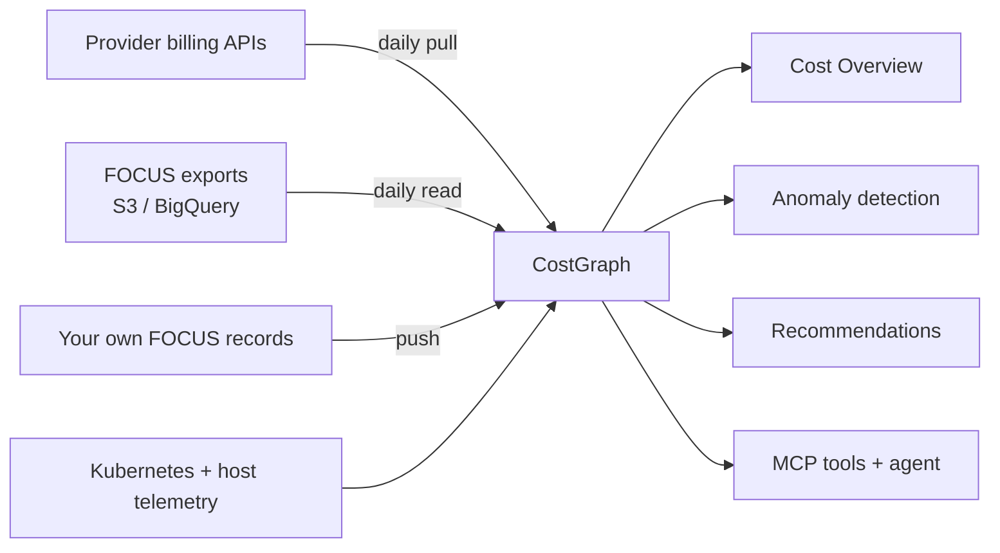

CostGraph reads spend from every provider you pay, normalises it to
[FOCUS 1.2](https://focus.finops.org), and stores it in one dataset. One schema
means Cost Overview, anomaly detection, recommendations, and the MCP tools work the
same whether the charge came from AWS, an LLM gateway, or a Kafka cluster.

<CardGroup cols={3}>
  <Card title="22 providers" icon="plug">
    Hyperscalers, IaaS, databases, AI, and SaaS, all in the same schema.
  </Card>
  <Card title="Pull or push" icon="arrows-left-right">
    Give us a read-only credential, or send FOCUS records yourself and keep the credential.
  </Card>
  <Card title="One dataset" icon="layer-group">
    No per-provider views to learn. Compare spend across providers in one place.
  </Card>
</CardGroup>

## How the data reaches us

Two directions, same destination.

<CardGroup cols={2}>
  <Card title="CostGraph pulls it" icon="cloud-arrow-down">
    You supply a read-only credential and we call the provider once a day. Nothing to
    run, nothing to schedule. This is how most integrations work.
  </Card>
  <Card title="You push it" icon="cloud-arrow-up" href="/costgraph/integrations/focus-push">
    You POST FOCUS records to our API. Credentials never leave your infrastructure, and
    it covers providers we cannot reach at all: internal chargeback, a warehouse job, a
    private cloud.
  </Card>
</CardGroup>

Your bill and your telemetry land in the same place, which is what lets a node bill be
split across namespaces and a pod be priced against a real SKU.

## Providers

### Hyperscalers

Read from a native FOCUS export rather than a billing API.

<CardGroup cols={2}>
  <Card title="Amazon Web Services" icon="aws" href="/costgraph/integrations/aws">
    FOCUS Data Export delivered to S3.
  </Card>
  <Card title="Google Cloud" icon="google" href="/costgraph/integrations/gcp">
    FOCUS billing export in BigQuery.
  </Card>
</CardGroup>

### Cloud and edge

<CardGroup cols={3}>
  <Card title="DigitalOcean" icon="digital-ocean" href="/costgraph/integrations/digitalocean">
    Droplets, volumes, load balancers, databases, spaces.
  </Card>
  <Card title="OVHcloud" icon="cloud" href="/costgraph/integrations/ovhcloud">
    Per bill line item, Public Cloud usage per project.
  </Card>
  <Card title="STACKIT" icon="cloud" href="/costgraph/integrations/stackit">
    Per project across managed services.
  </Card>
  <Card title="Scaleway" icon="cloud" href="/costgraph/integrations/scaleway">
    Per project, SKU, and resource.
  </Card>
  <Card title="Cloudflare" icon="cloudflare" href="/costgraph/integrations/cloudflare">
    Billable usage per product.
  </Card>
  <Card title="Vercel" icon="vercel" href="/costgraph/integrations/vercel">
    Charges per project across the team.
  </Card>
</CardGroup>

### Data and streaming

<CardGroup cols={3}>
  <Card title="PlanetScale" icon="database" href="/costgraph/integrations/planetscale">
    Cost plus per-node rightsizing from live database metrics.
  </Card>
  <Card title="Redis Cloud" icon="database" href="/costgraph/integrations/rediscloud">
    FOCUS-native report per subscription and database.
  </Card>
  <Card title="Confluent Cloud" icon="wind" href="/costgraph/integrations/confluent">
    Kafka spend per cluster and environment.
  </Card>
</CardGroup>

### AI and LLM

Model spend lands in the same dataset as infrastructure, which is what makes
cross-model comparison possible.

<CardGroup cols={3}>
  <Card title="Anthropic" icon="robot" href="/costgraph/integrations/anthropic">
    Per model and token bucket.
  </Card>
  <Card title="OpenAI" icon="robot" href="/costgraph/integrations/openai">
    Per model and token bucket.
  </Card>
  <Card title="OpenRouter" icon="shuffle" href="/costgraph/integrations/openrouter">
    One connection covers every upstream model you route through.
  </Card>
  <Card title="Helicone" icon="shuffle" href="/costgraph/integrations/helicone">
    Gateway spend across every model and upstream provider.
  </Card>
  <Card title="RespanAI" icon="shuffle" href="/costgraph/integrations/respanai">
    Request spend across every routed model.
  </Card>
  <Card title="Cursor" icon="code" href="/costgraph/integrations/cursor">
    Team usage per model and per member.
  </Card>
</CardGroup>

### Developer platforms and compute

<CardGroup cols={2}>
  <Card title="GitHub" icon="github" href="/costgraph/integrations/github">
    Actions minutes, Packages storage, Copilot seats.
  </Card>
  <Card title="Modal" icon="microchip" href="/costgraph/integrations/modal">
    Serverless GPU, CPU, and memory per function.
  </Card>
</CardGroup>

### Observability and FinOps

<CardGroup cols={3}>
  <Card title="Datadog" icon="dog" href="/costgraph/integrations/datadog">
    Your own Datadog bill by organization and product.
  </Card>
  <Card title="Grafana Cloud" icon="chart-line" href="/costgraph/integrations/grafanacloud">
    Metrics, logs, traces, profiles per stack.
  </Card>
  <Card title="CostGraph" icon="dollar-sign" href="/costgraph/integrations/costgraph">
    Fold your CostGraph invoice into the dataset it watches.
  </Card>
</CardGroup>

### Anything else

<Card title="Push FOCUS data" icon="cloud-arrow-up" href="/costgraph/integrations/focus-push">
  A provider that is not listed, an internal chargeback system, a private cloud: send
  the records yourself with a `focus:write` API key. They behave like any other source.
</Card>

## Connecting one

Every pull integration follows the same three steps, and the form tells you which
credential each provider needs and what permission it requires.

<Frame caption="Settings -> Integrations lists every provider with its setup guide.">
  
</Frame>

<Steps>
  <Step title="Pick the provider">
    Open **Settings -> Integrations** and choose it from the catalogue.
  </Step>
  <Step title="Name the connection and pick the tenant">
    The tenant decides which workspace the charges are attributed to.
  </Step>
  <Step title="Fill in the credential and connect">
    We verify it with a short fetch before saving, so a wrong value or a missing
    permission fails while you are still on the form, not silently at 3am.
  </Step>
</Steps>

<Note>
Credentials are encrypted at rest and used only to read billing data. Revoking the
key at the provider stops that connection and affects nothing else.
</Note>

## Where the data shows up

<Frame caption="Cost, grouped by provider and resource, with every connected source in one total.">
  
</Frame>

Once a connection syncs, that provider appears everywhere without further setup:

<CardGroup cols={2}>
  <Card title="Cost Overview" icon="chart-pie">
    Month-to-date and historical spend, sliced by provider, service, and tenant.
  </Card>
  <Card title="Anomaly detection" icon="triangle-exclamation">
    Spikes, waste, and drift caught within a provider and across providers.
  </Card>
  <Card title="Recommendations" icon="wand-magic-sparkles" href="/costgraph/agent/recommendations">
    Rightsizing and placement priced against the [Pricing API](/api-reference/introduction).
  </Card>
  <Card title="MCP and the agent" icon="plug" href="/costgraph/mcp/install">
    Ask about any connected provider from your editor or from chat.
  </Card>
</CardGroup>
