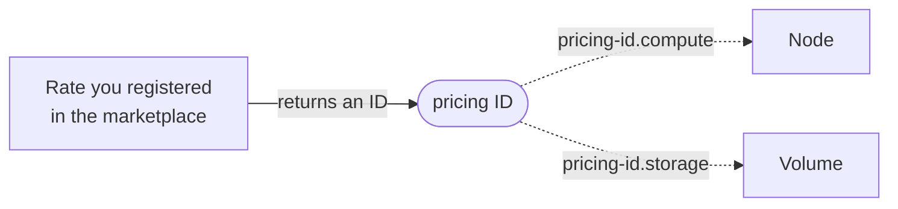
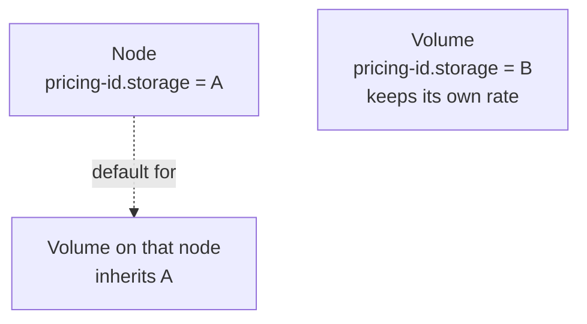
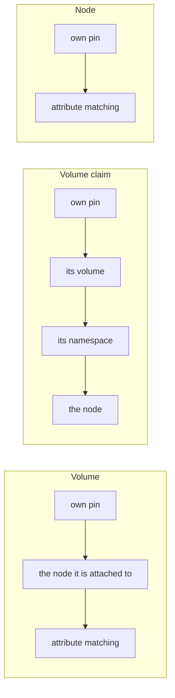

A resource running outside a supported cloud has no instance type, region or
provider ID for CostGraph to price against. Instead of inventing those, tag the
resource with the ID of a rate you registered in the pricing marketplace.

A pricing ID is per **dimension**, so one object can carry a compute rate and a
storage rate at the same time:

```
costgraph.ai/pricing-id.compute = <uuid>
costgraph.ai/pricing-id.storage = <uuid>
```

Register a rate once, then tag every resource that bills at it:



The same ID can be tagged onto as many resources as bill at that rate, and
changing the rate reprices all of them at once.

## Dimensions

| Suffix | Rate it points at | Register with |
|--------|-------------------|---------------|
| `.compute` | compute rate | [`POST /marketplace/providers/compute`](https://docs.costgraph.ai/api-reference/register-a-custom-provider) |
| `.storage` | disk rate | [`POST /marketplace/providers/disks`](https://docs.costgraph.ai/api-reference/register-a-custom-disk-provider) |
| `.database` | managed database rate | [`POST /marketplace/providers/databases`](https://docs.costgraph.ai/api-reference/register-custom-database-pricing) |
| `.model` | model token rate | [`POST /marketplace/providers/models`](https://docs.costgraph.ai/api-reference/register-custom-model-pricing) |

A key with no suffix is read as `.compute` on a node and `.storage` on a volume.
Prefer the explicit suffix.

## Register a rate

Full request and response schema:
[Register a custom provider](https://docs.costgraph.ai/api-reference/register-a-custom-provider)
for compute, and
[Register a custom disk provider](https://docs.costgraph.ai/api-reference/register-a-custom-disk-provider)
for storage.

```bash
curl -X POST https://pricing.baselinehq.cloud/marketplace/providers/compute \
  -H "Authorization: Bearer $COSTGRAPH_API_KEY" \
  -H "Content-Type: application/json" \
  -d '{"entries":[{"service":"BaseCompute","region":"dc-east","instance_type":"bare-metal-xl","operating_system":"linux","cpu_cores":64,"ram_gb":512,"cost_per_hour":1.85,"period_billing_hours":730}]}'
```

A disk rate takes capacity bounds instead of CPU and memory:

```bash
curl -X POST https://pricing.baselinehq.cloud/marketplace/providers/disks \
  -H "Authorization: Bearer $COSTGRAPH_API_KEY" \
  -H "Content-Type: application/json" \
  -d '{"entries":[{"service":"BaseDisks","region":"dc-east","type":"nvme","usage_type":"ONDEMAND","cost_per_gb_hour":0.0002,"min_capacity_gb":0,"max_capacity_gb":65536,"period_billing_hours":730}]}'
```

The response carries an `id` for each entry. That UUID is what you tag with.

## Tag the resource

On Kubernetes, use labels:

```bash
COMPUTE_ID="00000000-0000-0000-0000-000000000000"
STORAGE_ID="11111111-1111-1111-1111-111111111111"

kubectl label node/node-1 costgraph.ai/pricing-id.compute="$COMPUTE_ID" --overwrite
kubectl label nodes -l rack=r1 costgraph.ai/pricing-id.compute="$COMPUTE_ID" --overwrite
kubectl label pv/pv-1 costgraph.ai/pricing-id.storage="$STORAGE_ID" --overwrite
```

Review what is tagged with:

```bash
kubectl get nodes -L costgraph.ai/pricing-id.compute
```

Everywhere else, use the provider's resource tags with the same key and value.

A tagged resource needs no other metadata. CPU and memory still come from the
node's capacity, and volume size from the PV, because those are the billed
quantities.

## Tag keys on each provider

Not every provider accepts the canonical key verbatim. CostGraph matches keys
case-insensitively after replacing `/`, `.` and `-` with `_`, so the alias your
provider allows resolves to the same pin.

| Target | Key to set |
|--------|------------|
| Kubernetes labels | `costgraph.ai/pricing-id.compute` |
| AWS tags | `costgraph.ai/pricing-id.compute` |
| Azure tags | `costgraph.ai_pricing-id.compute` |
| GCP labels | `costgraph_ai_pricing_id_compute` |

Azure tag names reject `/`. GCP label keys allow only lowercase letters, digits,
`-` and `_`, and must start with a letter.

## Inheritance

Every object is priced in its own right. An object with no pin of its own takes
the rate from the nearest scope above it, so tagging one node can price the
volumes on it without tagging each one.



The nearest pin wins, and each kind of object looks outward along its own path:



A volume and its claim are separate objects and can carry different rates. A
volume with no consumer has no node above it, so with no pin of its own it falls
straight to attribute matching.

<Note>
  A node is not in any namespace, so tagging a namespace never changes a node's
  own rate. It reaches the claims in that namespace.
</Note>

## What a pin changes

A pin sets **ListCost**: the rate you would be charged at list. It never
overwrites **BilledCost**, which comes from an ingested bill. On a resource with
no bill behind it, such as a bare-metal node, ListCost is the only cost there is.
On a resource that is also billed, you get both, and the difference is your
discount. Pins never double-count against an invoice.

## Change a rate

Re-POST the same entry with a new `cost_per_hour`. The ID is unchanged and every
tagged resource picks up the new rate from the next hour. Already-billed hours
keep the rate they were billed at.

<Warning>
  Changing `region`, `instance_type` or `period_billing_hours` creates a new rate
  with a new ID, because those describe a different SKU. Re-tag the affected
  resources with the new ID.
</Warning>

## Share a rate

Anyone holding the ID can tag with it, which is how a provider prices the
clusters they sell to. Only your own organisation's rates are listed back to you,
so treat an ID as a secret you hand out deliberately.

## Fix a mistake

Re-tag with the correct ID and the change applies on the next sync. Remove a
Kubernetes label with a trailing hyphen:

```bash
kubectl label node/node-1 costgraph.ai/pricing-id.compute-
```

Removing the tag removes the pin. The resource falls back to a pin inherited
from an ancestor, then to normal attribute matching.

If the ID is malformed, or names a rate that has been deleted, CostGraph logs a
warning naming the resource and the value, and leaves that dimension unpriced. It
never falls back to attribute matching to cover for a bad ID.
